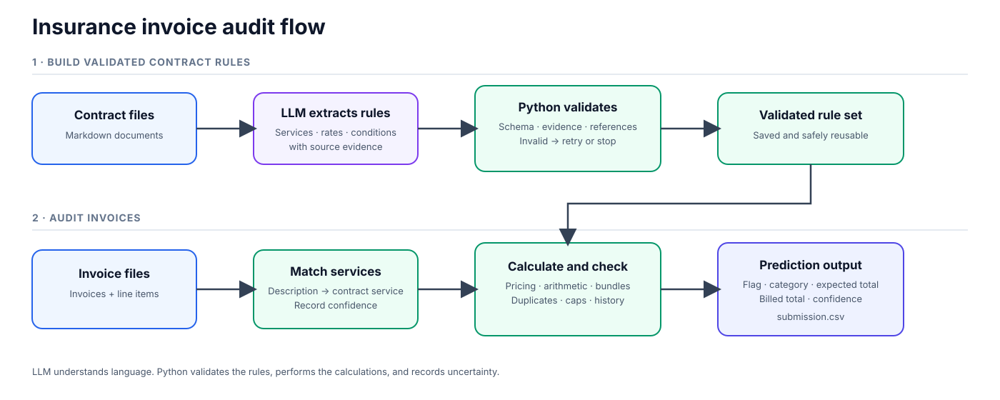

# Insurance Invoice Auditing

A reproducible pipeline that reads hospital contracts, converts them into validated rules, and checks invoices against those rules.



## How it works

1. **Understand the contract:** GLM-5.3 extracts services, rates, dates, premiums, discounts, bundles, exclusions, caps, amendments, and calculation order.
2. **Validate the extraction:** Python checks the schema, cited evidence, references, dates, numbers, coverage, and amendment consistency. Invalid extraction is retried or stops the run.
3. **Match line items:** Each invoice description is mapped to a contract service with a confidence score. Ambiguous matches remain visible.
4. **Audit deterministically:** Python calculates the expected amount and checks invoice arithmetic, duplicates, bundles, exclusions, daily caps, and cumulative thresholds.
5. **Write predictions:** Each invoice receives a flag, error category, expected total, billed total, and confidence.

The LLM interprets contract language. Python owns validation, arithmetic, and enforceable business rules.

## Quick start

Python 3.11 or later is required.

```bash
python3 -m venv .venv
.venv/bin/pip install -e .
```

The repository includes validated H1-H3 contract extractions, so the submitted results can be reproduced without an API key. For a new or changed contract, create `.env` and add your Z.AI key:

```bash
cp .env.example .env
```

```text
GLM_API_KEY=your_key_here
```

Inspect how a contract will be divided without calling the API:

```bash
.venv/bin/python audit_pipeline/cli.py --hospitals 1 --inspect-chunks
```

Run Hospital 1 and generate its evaluation report:

```bash
.venv/bin/python audit_pipeline/cli.py --hospitals 1
```

Generate the submitted Hospital 2 and Hospital 3 predictions:

```bash
.venv/bin/python audit_pipeline/cli.py --hospitals 2 3
```

Validated contract extractions are reused only when the contract, model, prompt, provider, and schema versions still match. A cache mismatch triggers a fresh LLM extraction and therefore requires an API key.

## Main outputs

- `submission.csv` — combined Hospital 2 and Hospital 3 submission.
- `hospital_2_submission.csv` and `hospital_3_submission.csv` — the same predictions separated by hospital.
- `artifacts/hospital_N_predictions.csv` — predictions for one hospital.
- `artifacts/audit_details/hospital_N.json` — service matches, applied rules, calculations, and uncertainty.
- `artifacts/contracts/hospital_N.json` — normalized contract rules.
- `artifacts/hospital_1_evaluation.md` — development-set results and failure analysis.

## Project map

- `audit_pipeline/` — contract agent, matching, validation, pricing, and CLI.
- `config/prompts/` — versioned LLM prompts.
- `config/schemas/` — structured contract schema.
- `data/` — supplied contracts, invoices, labels, and submission template.
- `tests/` — automated tests.
- `docs/` — detailed system flow and file guide.

## Evaluation and scope

Hospital 1 is the labelled development set. The current run achieves **100% classification accuracy and F1**, with **97.8% exact expected-total accuracy**. The final submission covers Hospitals 2 and 3; Hospitals 4 and 5 were intentionally left for further work rather than submitted with thin validation.

See [DECISION_LOG.md](DECISION_LOG.md) for assumptions, limitations, AI-assistance disclosure, and what I would do with another week.
